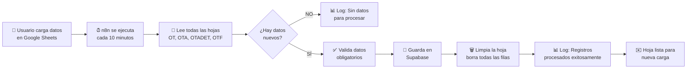

# 📊 Configuración de Google Sheets para Sistema OT

## 📋 Índice
- [Descripción General](#descripción-general)
- [Estructura de las Hojas](#estructura-de-las-hojas)
- [Flujo de Datos](#flujo-de-datos)
- [Configuración Paso a Paso](#configuración-paso-a-paso)
- [Comportamiento del Sistema](#comportamiento-del-sistema)
- [Preguntas Frecuentes](#preguntas-frecuentes)

---

## 📖 Descripción General

El sistema utiliza **un único Google Sheet** con **múltiples hojas (tabs)** para recibir los datos de las diferentes etapas de la orden de transferencia:

- **OT**: Solicitud de transferencia (cantidad solicitada)
- **OTA**: Preparación (cantidad preparada)
- **OTADET**: Detalle por EAN (códigos de barras específicos)
- **OTF**: Recepción final (cantidad recepcionada)

### ¿Cómo funciona?

1. **Cargas datos** en cualquiera de las hojas
2. **n8n lee automáticamente** cada 10 minutos
3. **Guarda en Supabase** los registros válidos
4. **Limpia la hoja** automáticamente (borra todas las filas excepto el header)
5. **La hoja queda lista** para una nueva carga

> **💡 Importante**: Ya NO se usa el campo `procesado`. El sistema borra directamente los datos después de procesarlos exitosamente.

---

## 📊 Estructura de las Hojas

### Hoja 1: OT (Solicitud)

Registra las órdenes de transferencia solicitadas.

| Columna | Tipo | Obligatorio | Descripción | Ejemplo |
|---------|------|-------------|-------------|---------|
| `id_ot` | Texto | ✅ Sí | ID único de la orden | `OT-2024-001` |
| `sku` | Texto | ✅ Sí | Código del producto | `SKU12345` |
| `mlc` | Texto | ❌ No | Código MercadoLibre | `MLA123456789` |
| `cliente` | Texto | ❌ No | Nombre o ID del cliente | `Cliente ABC` |
| `fecha_solicitud` | Fecha | ❌ No | Fecha de solicitud | `2024-11-28T10:00:00Z` |
| `fecha_transferencia_comprometida` | Fecha | ❌ No | Fecha comprometida | `2024-11-30T10:00:00Z` |
| `cantidad_solicitada` | Número | ✅ Sí | Cantidad solicitada | `100` |

**Ejemplo de datos:**

```csv
id_ot,sku,mlc,cliente,fecha_solicitud,fecha_transferencia_comprometida,cantidad_solicitada
OT-2024-001,SKU12345,MLA123456789,Cliente ABC,2024-11-28T10:00:00Z,2024-11-30T10:00:00Z,100
OT-2024-001,SKU67890,,Cliente XYZ,2024-11-28T10:00:00Z,2024-11-30T10:00:00Z,50
OT-2024-002,SKU11111,MLA987654321,Cliente ABC,2024-11-28T11:00:00Z,2024-12-01T10:00:00Z,200
```

---

### Hoja 2: OTA (Preparación)

Registra la preparación de las órdenes.

| Columna | Tipo | Obligatorio | Descripción | Ejemplo |
|---------|------|-------------|-------------|---------|
| `id_ot` | Texto | ✅ Sí | ID de la orden (debe existir en OT) | `OT-2024-001` |
| `sku` | Texto | ✅ Sí | Código del producto | `SKU12345` |
| `fecha_preparacion` | Fecha | ❌ No | Fecha de preparación | `2024-11-29T14:00:00Z` |
| `cantidad_preparada` | Número | ✅ Sí | Cantidad preparada | `98` |

**Ejemplo de datos:**

```csv
id_ot,sku,fecha_preparacion,cantidad_preparada
OT-2024-001,SKU12345,2024-11-29T14:00:00Z,98
OT-2024-001,SKU67890,2024-11-29T14:30:00Z,50
OT-2024-002,SKU11111,2024-11-29T15:00:00Z,195
```

> **⚠️ Nota**: Si la diferencia entre `cantidad_solicitada` y `cantidad_preparada` supera el 2%, se generará una alerta automática.

---

### Hoja 3: OTADET (Detalle por EAN)

Registra el detalle de cada EAN preparado (códigos de barras específicos).

| Columna | Tipo | Obligatorio | Descripción | Ejemplo |
|---------|------|-------------|-------------|---------|
| `id_ot` | Texto | ✅ Sí | ID de la orden | `OT-2024-001` |
| `sku` | Texto | ✅ Sí | Código del producto | `SKU12345` |
| `ean` | Texto | ✅ Sí | Código de barras EAN | `7890123456789` |
| `cantidad_preparada_ean` | Número | ✅ Sí | Cantidad de este EAN | `48` |

**Ejemplo de datos:**

```csv
id_ot,sku,ean,cantidad_preparada_ean
OT-2024-001,SKU12345,7890123456789,48
OT-2024-001,SKU12345,7890123456790,50
OT-2024-001,SKU67890,7890123456791,50
```

> **⚠️ Nota**: El sistema valida automáticamente que los EAN existan en el catálogo PIM y que correspondan al SKU correcto.

---

### Hoja 4: OTF (Recepción)

Registra la recepción final en destino.

| Columna | Tipo | Obligatorio | Descripción | Ejemplo |
|---------|------|-------------|-------------|---------|
| `id_ot` | Texto | ✅ Sí | ID de la orden | `OT-2024-001` |
| `sku` | Texto | ✅ Sí | Código del producto | `SKU12345` |
| `fecha_recepcion` | Fecha | ❌ No | Fecha de recepción | `2024-12-01T09:00:00Z` |
| `cantidad_recepcionada` | Número | ✅ Sí | Cantidad recepcionada | `98` |

**Ejemplo de datos:**

```csv
id_ot,sku,fecha_recepcion,cantidad_recepcionada
OT-2024-001,SKU12345,2024-12-01T09:00:00Z,98
OT-2024-001,SKU67890,2024-12-01T09:15:00Z,48
OT-2024-002,SKU11111,2024-12-01T10:00:00Z,195
```

> **⚠️ Nota**: Si la diferencia entre `cantidad_preparada` y `cantidad_recepcionada` supera el 5%, se generará una alerta automática.

---

## 🔄 Flujo de Datos



### Proceso Detallado

1. **Carga de Datos**
   - Usuario copia/pega o importa datos en cualquier hoja
   - No necesita marcar nada como "procesado"
   - Puede cargar datos en múltiples hojas simultáneamente

2. **Lectura Automática**
   - n8n se ejecuta cada 10 minutos
   - Lee **todas las hojas en paralelo** (OT, OTA, OTADET, OTF)
   - Valida campos obligatorios (id_ot, sku, cantidades)

3. **Procesamiento**
   - Datos válidos → Guarda en Supabase
   - Datos inválidos → Registra en log (no se guardan)
   - Continúa con los siguientes registros

4. **Limpieza Automática**
   - **Borra TODAS las filas** de datos de la hoja
   - **Mantiene el header** (primera fila con nombres de columnas)
   - Esto sucede **solo después** de guardar exitosamente en Supabase

5. **Validaciones Adicionales**
   - Otro flujo (cada 15 min) valida diferencias y genera alertas
   - Se envían emails automáticos si hay inconsistencias

---

## ⚙️ Configuración Paso a Paso

### Paso 1: Crear el Google Sheet

1. Ve a [Google Sheets](https://sheets.google.com)
2. Crea un nuevo documento
3. Nómbralo como `Sistema_OT_Produccion`
4. Copia el ID del Sheet desde la URL:
   ```
   https://docs.google.com/spreadsheets/d/1ABC...XYZ/edit
                                            ^^^^^^^^^
                                            Este es el ID
   ```

### Paso 2: Crear las 4 Hojas (Tabs)

1. **Renombra la primera hoja** como `OT`
2. **Crea 3 hojas adicionales**: 
   - Haz clic en el **+** en la parte inferior
   - Nómbralas como `OTA`, `OTADET`, `OTF`

### Paso 3: Agregar Headers (Primera Fila)

#### Hoja OT:
```
id_ot | sku | mlc | cliente | fecha_solicitud | fecha_transferencia_comprometida | cantidad_solicitada
```

#### Hoja OTA:
```
id_ot | sku | fecha_preparacion | cantidad_preparada
```

#### Hoja OTADET:
```
id_ot | sku | ean | cantidad_preparada_ean
```

#### Hoja OTF:
```
id_ot | sku | fecha_recepcion | cantidad_recepcionada
```

### Paso 4: Configurar Permisos

1. Haz clic en **Compartir** (botón superior derecho)
2. Agrega la cuenta de servicio de Google que usas en n8n
3. Dale permisos de **Editor**

### Paso 5: Actualizar n8n

1. Importa el flujo `Flujo_Unificado_Ingesta_OT.json`
2. Busca `TU_GOOGLE_SHEET_ID` en todos los nodos
3. Reemplázalo con el ID que copiaste en el Paso 1
4. Actualiza las credenciales de Google Sheets
5. Activa el workflow

---

## 🎯 Comportamiento del Sistema

### ✅ Lo que SÍ hace el sistema

- ✅ Lee automáticamente cada 10 minutos
- ✅ Procesa **todas las hojas en paralelo**
- ✅ Valida campos obligatorios antes de guardar
- ✅ Guarda registros válidos en Supabase
- ✅ **Borra automáticamente** los datos después de procesar
- ✅ Genera logs detallados de cada ejecución
- ✅ Envía alertas por email si detecta inconsistencias
- ✅ Maneja errores sin detener el flujo completo

### ❌ Lo que NO hace el sistema

- ❌ NO valida formatos de fecha avanzados (usa ISO 8601)
- ❌ NO mantiene histórico en Google Sheets (se borra)
- ❌ NO procesa hojas con nombres diferentes a OT/OTA/OTADET/OTF
- ❌ NO guarda registros con campos obligatorios vacíos
- ❌ NO notifica cuando NO hay datos para procesar

### 🔄 Comportamiento de Limpieza

```javascript
// Después de procesar exitosamente:
// 1. Elimina TODAS las filas con datos
// 2. Mantiene la fila de header (fila 1)
// 3. La hoja queda así:

Antes del procesamiento:
┌────────────┬──────────┬──────────────────────┐
│ id_ot      │ sku      │ cantidad_solicitada  │  ← Header (se mantiene)
├────────────┼──────────┼──────────────────────┤
│ OT-001     │ SKU123   │ 100                  │  ← Datos (se borran)
│ OT-002     │ SKU456   │ 200                  │  ← Datos (se borran)
│ OT-003     │ SKU789   │ 150                  │  ← Datos (se borran)
└────────────┴──────────┴──────────────────────┘

Después del procesamiento:
┌────────────┬──────────┬──────────────────────┐
│ id_ot      │ sku      │ cantidad_solicitada  │  ← Header (se mantiene)
├────────────┼──────────┼──────────────────────┤
│            │          │                      │  ← Vacío, listo para nuevos datos
└────────────┴──────────┴──────────────────────┘
```

---

## ❓ Preguntas Frecuentes

### ¿Por qué se eliminó el campo "procesado"?

**Respuesta**: Simplificación del flujo. Ahora:
- ✅ Es más simple: solo cargas datos y el sistema los procesa
- ✅ No hay errores por marcar mal el campo
- ✅ La hoja siempre queda limpia y lista
- ✅ Menos mantenimiento manual

### ¿Qué pasa si cargo datos mientras n8n está procesando?

**Respuesta**: No hay problema. n8n procesa todos los datos que encuentra en ese momento. Si agregas más datos después, se procesarán en la siguiente ejecución (10 minutos después).

### ¿Puedo ver qué se procesó?

**Respuesta**: Sí, en dos lugares:
1. **En n8n**: Ve a Executions → Ver detalles de la última ejecución
2. **En Supabase**: Consulta la tabla `logs_integracion`

```sql
SELECT * FROM logs_integracion 
WHERE flujo_n8n = 'Flujo_Unificado_Ingesta_OT' 
ORDER BY timestamp DESC 
LIMIT 10;
```

### ¿Qué pasa si un registro tiene errores?

**Respuesta**: 
- El registro con errores **NO se guarda** en Supabase
- Se registra el error en el log de n8n
- Los demás registros **SÍ se procesan** normalmente
- El flujo continúa (no se detiene por un error)

### ¿Puedo recuperar datos borrados de Google Sheets?

**Respuesta**: 
- **NO** desde el sistema automático
- **SÍ** manualmente usando:
  - Historial de versiones de Google Sheets (Archivo → Historial de versiones)
  - Consultas a Supabase (los datos ya están guardados allí)

### ¿Cuántos registros puedo cargar a la vez?

**Respuesta**: 
- **Recomendado**: Hasta 1,000 registros por hoja
- **Máximo técnico**: Sin límite, pero puede tardar más en procesar
- **Sugerencia**: Si tienes muchos registros, divídelos en lotes de 500-1000

### ¿Puedo cargar datos manualmente sin esperar 10 minutos?

**Respuesta**: 
- **Sí**, en n8n:
  1. Ve al workflow `Flujo_Unificado_Ingesta_OT`
  2. Haz clic en **"Execute Workflow"** (botón "play")
  3. El flujo se ejecuta inmediatamente

### ¿Qué formato de fecha debo usar?

**Respuesta**: ISO 8601. Ejemplos válidos:
- `2024-11-28T10:00:00Z`
- `2024-11-28T10:00:00-03:00`
- `2024-11-28` (asume 00:00:00)

❌ **NO usar** formatos como:
- `28/11/2024` 
- `11-28-2024`
- `28-Nov-2024`

### ¿Puedo agregar columnas adicionales?

**Respuesta**:
- ✅ **Sí**, puedes agregar columnas al final
- ✅ El sistema solo lee las columnas que necesita
- ⚠️ **NO** cambies el orden ni nombres de las columnas obligatorias
- ⚠️ **NO** elimines las columnas del header

---

## 🚀 Flujo Completo de Ejemplo

### Escenario: Registrar una nueva orden de transferencia completa

#### 1. **Carga Inicial** (Usuario carga en hoja OT)
```csv
id_ot,sku,mlc,cliente,fecha_solicitud,fecha_transferencia_comprometida,cantidad_solicitada
OT-2024-100,SKU-A1,MLA123,Cliente ABC,2024-11-28T10:00:00Z,2024-11-30T10:00:00Z,100
```

#### 2. **Procesamiento** (10 minutos después)
- ✅ n8n lee la hoja OT
- ✅ Guarda en `transfer_orders` con estado `Solicitado`
- ✅ Borra la fila de la hoja OT
- ✅ Hoja OT queda vacía (solo header)

#### 3. **Preparación** (Usuario carga en hoja OTA)
```csv
id_ot,sku,fecha_preparacion,cantidad_preparada
OT-2024-100,SKU-A1,2024-11-29T14:00:00Z,98
```

#### 4. **Procesamiento** (10 minutos después)
- ✅ n8n lee la hoja OTA
- ✅ Actualiza `transfer_orders` con estado `Preparado`
- ✅ Borra la fila de la hoja OTA
- ⚠️ **Detecta diferencia** (2% entre 100 y 98)
- ✉️ Envía alerta por email

#### 5. **Detalle EAN** (Usuario carga en hoja OTADET)
```csv
id_ot,sku,ean,cantidad_preparada_ean
OT-2024-100,SKU-A1,7890123456789,48
OT-2024-100,SKU-A1,7890123456790,50
```

#### 6. **Procesamiento** (10 minutos después)
- ✅ n8n lee la hoja OTADET
- ✅ Guarda en `transfer_orders_detalle_ean`
- ✅ Valida contra catálogo PIM
- ✅ Borra las filas de la hoja OTADET

#### 7. **Recepción** (Usuario carga en hoja OTF)
```csv
id_ot,sku,fecha_recepcion,cantidad_recepcionada
OT-2024-100,SKU-A1,2024-12-01T09:00:00Z,98
```

#### 8. **Procesamiento Final** (10 minutos después)
- ✅ n8n lee la hoja OTF
- ✅ Actualiza `transfer_orders` con estado `Entregado_Sin_Novedad`
- ✅ Borra la fila de la hoja OTF
- ✅ **Orden completada** 🎉

---

## 📞 Soporte

Si tienes problemas:

1. **Revisa los logs en n8n**:
   - Executions → Ver última ejecución
   - Busca mensajes de error en rojo

2. **Revisa logs en Supabase**:
```sql
SELECT * FROM logs_integracion 
WHERE exitoso = FALSE 
ORDER BY timestamp DESC;
```

3. **Consulta la documentación**:
   - `/n8n/docs/README_Flujos.md`
   - `/docs/troubleshooting.md`

---

**Versión**: 2.0.0  
**Última actualización**: Noviembre 2024  
**Sistema**: Flujo Unificado de Órdenes de Transferencia

